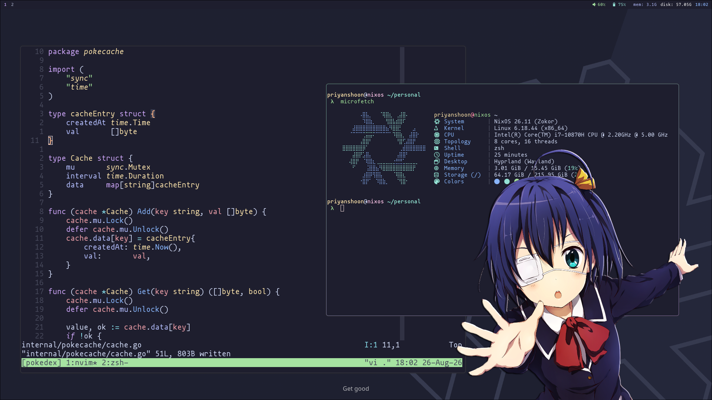

# NixOS Setup



Personal NixOS and Home Manager configuration for **Priyanshu Gupta**.

## Hosts

| Host | Platform | Desktop |
| --- | --- | --- |
| `nixos` | `x86_64-linux` | KDE Plasma 6 + Hyprland |

## Tools

### Configuration

- **Nix flakes** with `nixos-unstable`
- **Home Manager** for user-level configuration
- **NixVim** for Neovim
- NVIDIA hardware support and CUDA binary cache

### Desktop

- KDE Plasma 6, Hyprland, Waybar, Wofi, and Mako
- Ghostty and Alacritty terminals
- Firefox, Brave, Helium, Thunderbird, Telegram, Obsidian, MPV, GIMP, Shotcut, and OBS Studio

### Shell and development

- Zsh with Starship, zoxide, fzf, bat, btop, jq, and direnv
- Git with LazyGit, tmux, pass, and GnuPG SSH-agent support
- Node.js, Python, Go, pnpm, uv, GCC, GDB, Just, Typst, and JetBrains IDEA
- `pi` and Boot.dev CLI

### System utilities

- Docker Compose, libvirt/KVM, Wireshark, OpenTabletDriver, KDE Connect, Bluetooth, PipeWire, and Proton VPN

## Layout

```text
hosts/nixos/       # System configuration for the nixos host
home-manager/      # User packages and application configuration
assets/            # README assets
```
