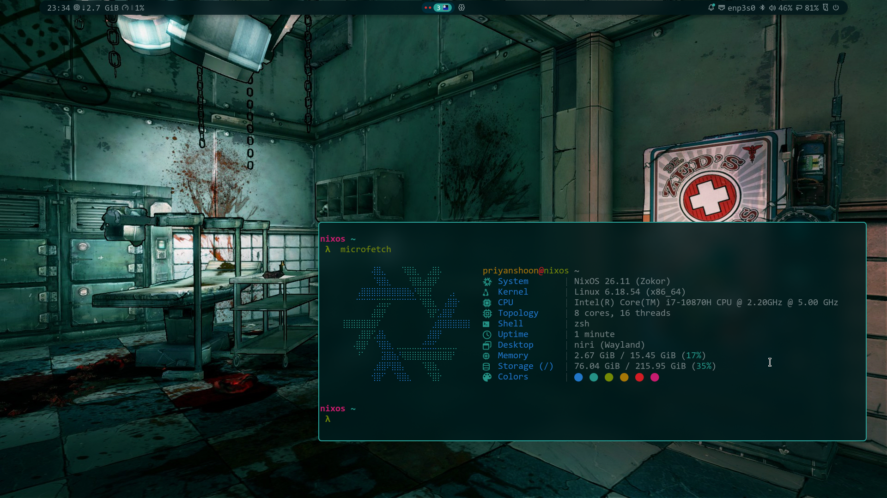

# NixOS Configuration



Personal NixOS and Home Manager configuration, built around a modern Wayland desktop.

## Highlights

- **NixOS** on the `nixos` (`x86_64-linux`) host, managed with flakes and `nixos-unstable`
- **Home Manager** for declarative user packages and application configuration
- **Niri**, a scrollable-tiling Wayland compositor, as the default session
- **Noctalia Shell** for the desktop panel, launcher, clipboard, and shell integration
- **NixVim** for a reproducible Neovim setup
- NVIDIA and CUDA support, including the CUDA binary cache

## Desktop

The desktop is configured around Niri and Noctalia Shell. The Niri configuration lives in `home-manager/modules/niri/config.kdl` and starts Noctalia automatically. KDE Plasma 6 is also available as a full desktop environment.

Applications include Ghostty, Firefox, Brave, Helium, Thunderbird, Telegram, Obsidian, MPV, GIMP, Shotcut, and OBS Studio.

## Development and system tools

- Zsh with Starship, zoxide, fzf, bat, btop, jq, and direnv
- Git, Jujutsu, LazyGit, tmux, pass, and GnuPG SSH-agent support
- Node.js, Python, Go, Rust, pnpm, uv, GCC, GDB, Just, Typst, and JetBrains IDEA
- Docker Compose, libvirt/KVM, Wireshark, OpenTabletDriver, KDE Connect, Bluetooth, PipeWire, and Proton VPN

## Layout

```text
flake.nix                 # Inputs and NixOS/Home Manager outputs
hosts/nixos/              # System configuration for the nixos host
home-manager/             # User packages and desktop/application configuration
assets/                   # README assets
```
